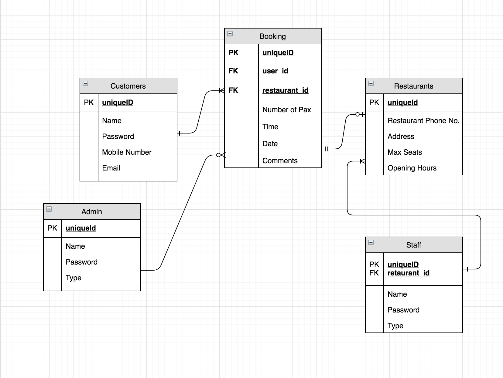
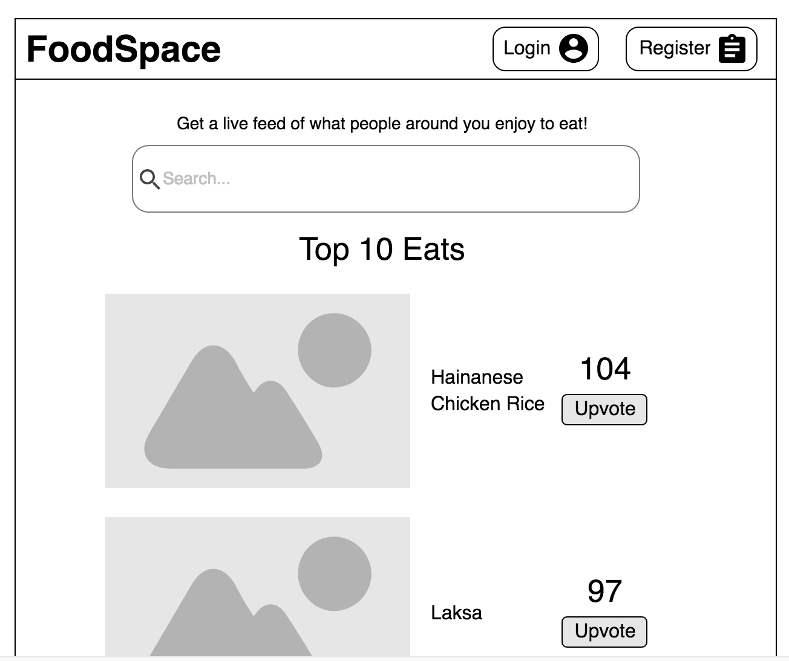
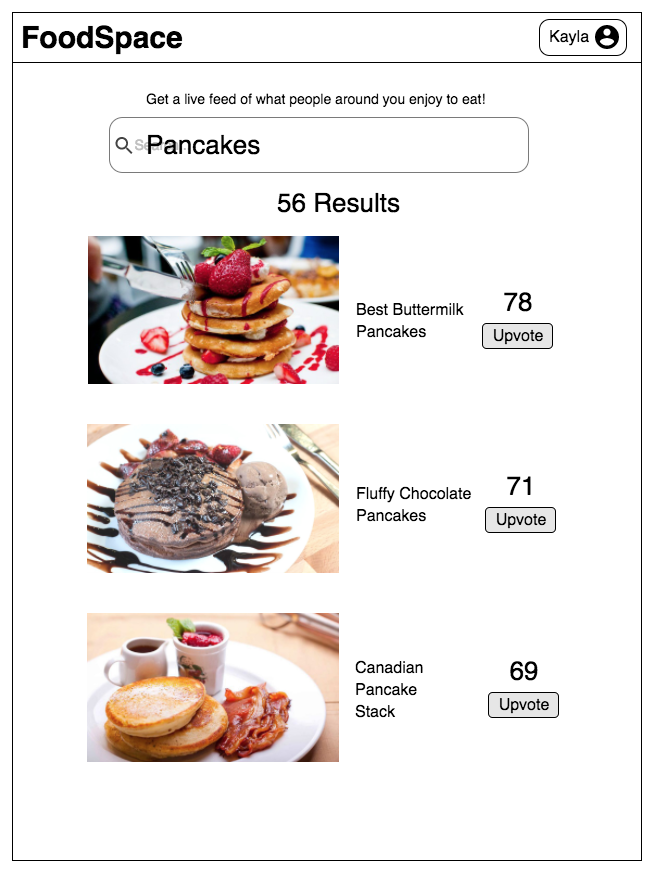
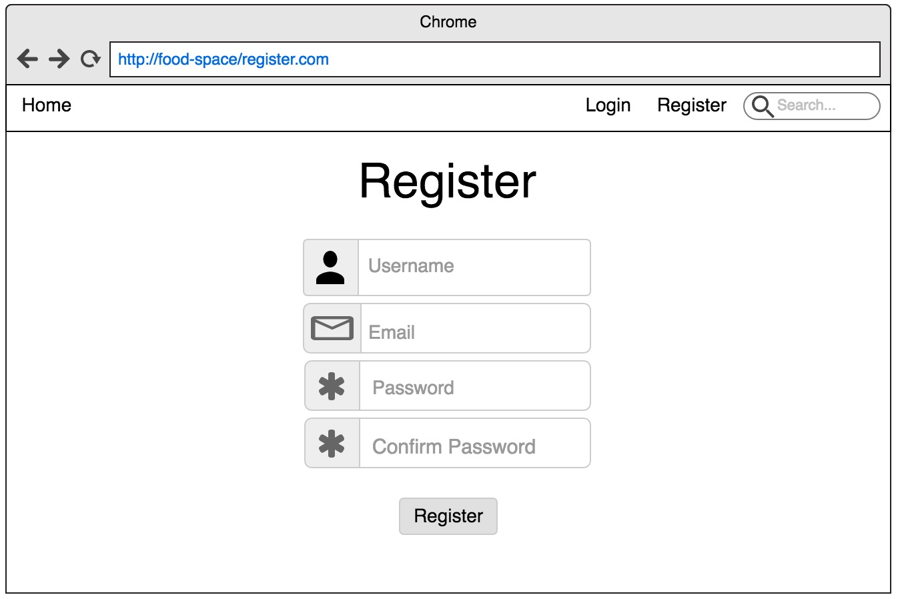
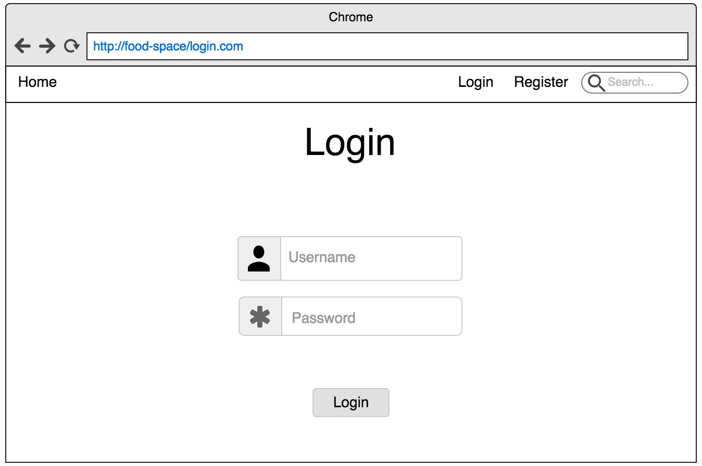

# FoodSpace
##### PROJECT 3

## Description
Find the most popular dishes in town and vote to make your best dish famous! Restaurants may also offer discounts on our app!

_____
## <center>Installation instructions

```sh
gem install
rails db:create
rails db:migrate
rails db:seed
```

## ERD


## HomePage


## Search Results Page


## Register


## Login


## <center>User Stories

### FoodSpace

How Customers would use this:
1. When a Customer loads the landing page, they can search for particular menu items they enjoy
2. A list of various restaurants serving the menu item appears, allowing customers to see which restaurant is the most popular for that specific menu item
3. Customers can upvote the menu items they prefer, allowing the public to control rankings of the menu items
4. Customers can upload pictures of dishes they enjoy if they are not in the list, subject to verification by admins
5. Customers must register and login to vote/upload

How Restaurant Owners/Staff would use this:
1. Owners can see where their menu items are located in the rankings and choose to give discounts on the specific menu items
3. Owners can also gain valuable feedback in the form of user ratings and reviews to adapt their menu
4. Owners are required to submit updated menus periodically to admins to confirm that dishes actually exist

## <center> Use Cases

* User
1. Users use the website to find popular dishes rated by public and then rate the dishes if they feel the food was good. They can also leave reviews for each dish.

* Owners
1. Owners can see set discounts and prices based on ratings of dishes

## <center> Wireframes

* Home page


# <center>Team Notes</center>
* If you are using seed data please propagate the restaurants before seeding data for the staffs table as the restaurant ID is required for the staff table.
___
## <center>Team Journal</center>
Joseph | Description | Bug/Framework
------ | --- | ---
1| Added working models | Framework
2| Loaded initial migration and seed data | Framework
3| Added working pages and default routes | Framework
4| Modified profile_edit page to contain & change more fields | Framework
5| Created case insensitive search function for home page | Framework
6| Added voting system | Framework
7| Resolved ruby in js.erb code bug (Needs to be placed elsewhere) | Bug
8| Resolved !user.owner bug | Bug
9| Resolved bug for edit page | Bug
10| Added search function for restaurants | Framework
11| Removed search bar from unnecessary pages and edited minor css for front page | Framework
12| Added cards for individual dishes layout | Framework
13| Solved new dish page bug | Bug
14| Added admin console and verification | Framework
15| Added delete function for restaurant and dishes to admin console | Framework
16| Modified flash messages and added favicon and cleaned up owner console page | Framework

Charmaine | Description | Bug/Framework
------ | --- | ---
1| Added edit page for dish details | Framework
2| Added delete page for dish | Framework
3| Added function to check if user is owner | Framework
4| Added dish picture upload function | Framework
5| Added create/new page for dish | Framework
6| Added google map for individual dish page | Framework
7| Added review model | Framework
8| Added review form in individual dish pages | Framework
9| Displaying reviews in individual dish pages | Framework

Li Yuan | Description | Bug/Framework
------ | --- | ---
1| Landing Pages: home/register/login | Framework
2| User Stories| Framework
3| Added wireframes | Framework
4| Data scraping for restaurants | Framework
5| Data scraping for dishes | Framework
6| Saved scraped data to database | Framework
7| CSS homepage how to use website and promotions | Framework
8| CSS show restaurant page | Framework

___
## Ask During Consultation
* Check with prima how to show those dishes without votes. Not sure about how to run the loop to compare against those that are already there(show all dishes page) - Jo

## Assumptions
* Owners may have more than one restaurant

## <center> To Do List
Description    | Importance | Type
-------- | --- | ---  
Add OCR API to allow users to split the bill| Medium | Framework
**COMPLETED** | ---- | ----
~~Allow searching of individual dishes/restaurants~~ | **HIGH** | Framework
~~Make search function async~~ | Medium | Framework
~~Add images to user profile~~ | Low | Framework
~~Update README with latest wireframe images~~ | Low | Framework
~~Add working routes for default pages~~ | **HIGH** | Framework
~~Implement CSS Framework and working form routes~~ | **HIGH** | Framework
~~Come up with search page logic~~ | **HIGH** | Framework
~~Add new dishes and delete dishes~~ | **HIGH** | Framework
~~Owner console~~ | **HIGH** | Framework
~~Scrape restaurant data~~ | Medium | Framework
~~Add google maps to allow show restaurant location~~| Low | Framework

## Potential Improvements
* ~~Add reviews for each dish~~
* Facebook login and share
* Additional promotions
* OCR scanning of bill to split payment
