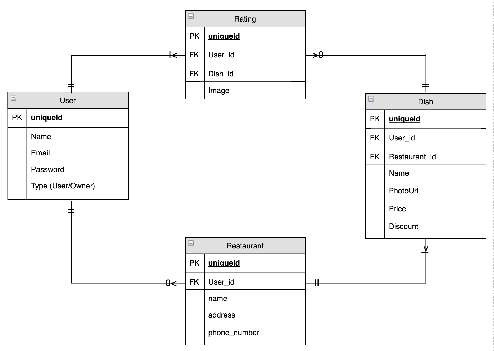

# FoodSpace
##### PROJECT 3

## Description
Find the most popular dishes in town and vote to make your best dish famous! Restaurants may also offer discounts on our app!

_____
## <center>Installation instructions

```sh
gem install
rails db:create
rails db:migrate
rails db:seed
```

## ERD


## HomePage


## Search Results Page


## Register


## Login


## <center>User Stories

### FoodSpace

How Customers would use this:
1. When a Customer loads the landing page, they can search for particular menu items they enjoy
2. A list of various restaurants serving the menu item appears, allowing customers to see which restaurant is the most popular for that specific menu item
3. Customers can upvote the menu items they prefer, allowing the public to control rankings of the menu items
4. Customers can upload pictures of dishes they enjoy if they are not in the list, subject to verification by admins
5. Customers must register and login to vote/upload

How Restaurant Owners/Staff would use this:
1. Owners can see where their menu items are located in the rankings and choose to give discounts on the specific menu items
3. Owners can also gain valuable feedback in the form of user ratings and reviews to adapt their menu
4. Owners are required to submit updated menus periodically to admins to confirm that dishes actually exist

## <center> Use Cases

* TBD

## <center> Wireframes

* Home page


# <center>Team Notes</center>
* If you are using seed data please propagate the restaurants before seeding data for the staffs table as the restaurant ID is required for the staff table.
___
## <center>Team Journal</center>
Joseph | Description | Bug/Framework
------ | --- | ---
1| Added working models | Framework
2| Loaded initial migration and seed data | Framework
3| Added working pages and default routes | Framework
4| Modified profile_edit page to contain & change more fields | Framework
5| Created case insensitive search function for home page | Framework

Charmaine | Description | Bug/Framework
------ | --- | ---
1| Added wireframes | Framework
2| text | text
3| text | text

Li Yuan | Description | Bug/Framework
------ | --- | ---
1| Landing Pages: home/register/login | Framework
2| User Stories| Framework
3| text | text
___
## Ask During Consultation
* Icons not working properly
* Image tags / link tags causing problems during formatting


## Assumptions
* Owners may have more than one restaurant

## <center> To Do List
Description    | Importance | Type
-------- | --- | ---  
Add google maps to allow search function based on user location | Framework
Make search function async | Medium | Framework
Add images to user profile | Low | Framework
Add OCR API & Facebook login | Medium | Framework
Scrape restaurant data | Medium | Framework
~~Update README with latest wireframe images~~ | Low | Framework
~~Add working routes for default pages~~ | **HIGH** | Framework
~~Implement CSS Framework and working form routes~~ | **HIGH** | Framework
~~Come up with search page logic~~ | **HIGH** | Framework

## Potential Improvements
* Add individual dish pages (with restaurant info)
* Add reviews for each dish
